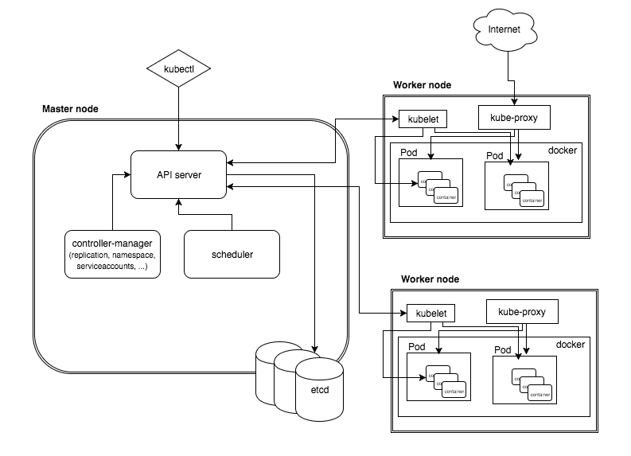
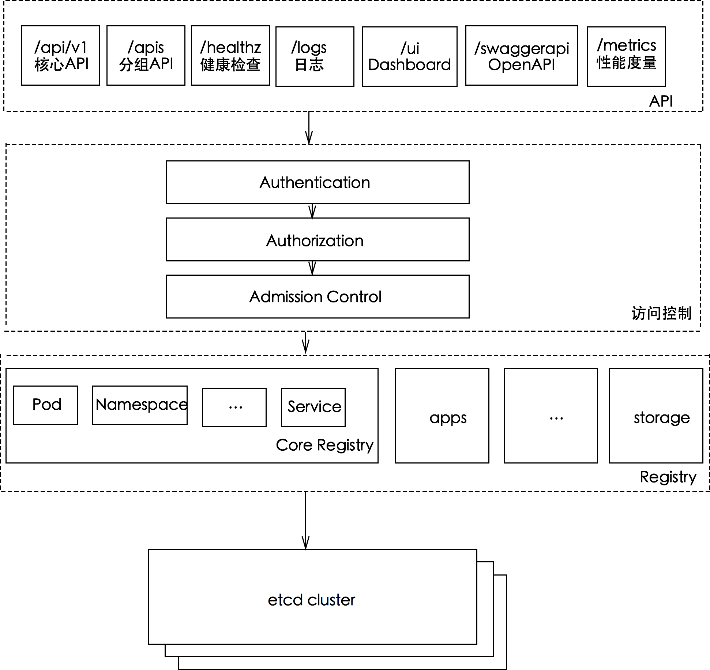
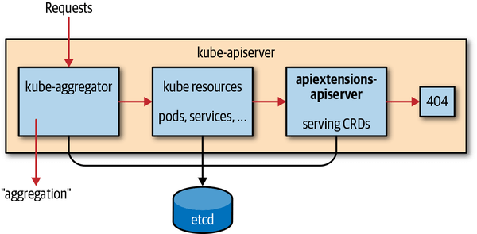
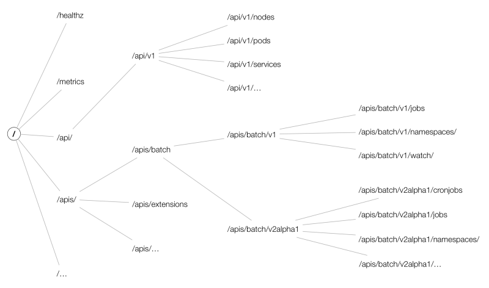
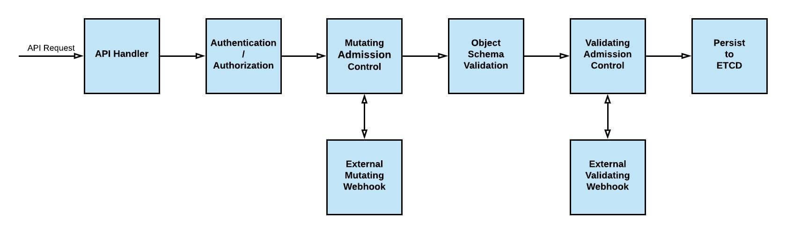

# kubernetes API Server 架构详解

## 概述

整个Kubernetes技术体系由声明式API以及Controller构成，而kube-apiserver是Kubernetes的声明式api server，并为其它组件交互提供了桥梁。因此加深对kube-apiserver的理解就显得至关重要

 

K8s API Server提供了k8s各类资源对象（Pod,Deployment,Service等）的增删改查及watch等HTTP Rest接口，是整个系统的数据总线和数据中心。

kubernetes API Server的功能：

* 提供了集群管理的REST API接口(包括认证授权、数据校验以及集群状态变更)
* 提供其他模块之间的数据交互和通信的枢纽（其他模块通过API Server查询或修改数据，只有API Server才直接操作etcd）;
* 是资源配额控制的入口
* 拥有完备的集群安全机制

 

## API 扩展机制
kube-apiserver 内部实现了下面这样一个 workflow

 

* kube-aggregator：处理本节这种反向代理需求，将请求转发给 API 对应的用户服务；如果没有命中，转 2；
* kube resources：处理内置的 pods, services 等内置资源；如果没有命中，转 3；
* apiextensions-apiserver：处理 CRD 资源的请求；如果没有命中，转 4；
* 返回 404。

kube-apiserver包含三种APIServer：

**aggregatorServer**：负责处理 apiregistration.k8s.io 组下的APIService资源请求，同时将来自用户的请求拦截转发给aggregated server(AA)
**kubeAPIServer**：负责对请求的一些通用处理，包括：认证、鉴权以及各个内建资源(pod, deployment，service and etc)的REST服务等
**apiExtensionsServer**：负责CustomResourceDefinition（CRD）apiResources以及apiVersions的注册，同时处理CRD以及相应CustomResource（CR）的REST请求(如果对应CR不能被处理的话则会返回404)，也是apiserver Delegation的最后一环

### kubeAPIServer
KubeAPIServer主要提供对内建API Resources的操作请求，为Kubernetes中各API Resources注册路由信息，同时暴露RESTful API，使集群中以及集群外的服务都可以通过RESTful API操作Kubernetes中的资源

另外，kubeAPIServer是整个Kubernetes apiserver的核心，下面将要讲述的aggregatorServer以及apiExtensionsServer都是建立在kubeAPIServer基础上进行扩展的(补充了Kubernetes对用户自定义资源的能力支持)

而API的URL大致以 /apis/{group}/{version}/namespaces/{namespace}/resource/{name} 组成，结构如下图所示：

 

### aggregatorServer
aggregatorServer主要用于处理扩展Kubernetes API Resources的第二种方式Aggregated APIServer(AA)，将CR请求代理给AA：

### apiExtensionsServer
apiExtensionsServer主要负责CustomResourceDefinition（CRD）apiResources以及apiVersions的注册，同时处理CRD以及相应CustomResource（CR）的REST请求(如果对应CR不能被处理的话则会返回404)，也是apiserver Delegation的最后一环

## Webhook 机制

 

两种 webhook：
* mutating webhook：拦截指定的资源请求，动态修改资源；
* validating webhook：功能与 mutation webhook 类似，核心是验证资源是否合法